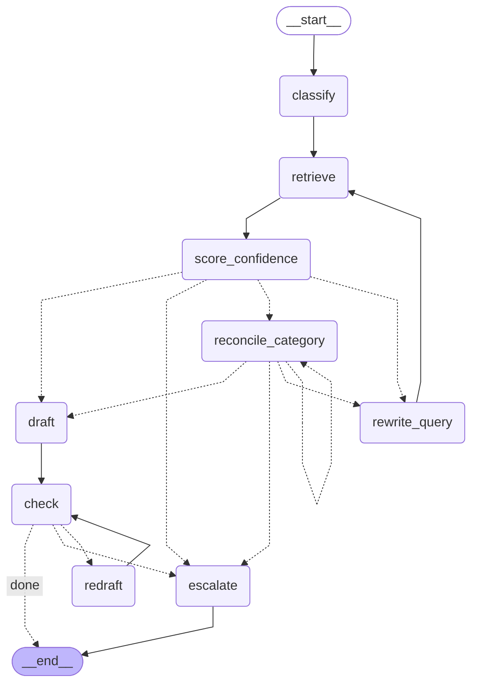

# Agent graph

Generated by `scripts/export_graph.py` from the compiled LangGraph. Solid arrows are fixed edges, dotted arrows are conditional edges (the router's choices).

```mermaid
---
config:
  flowchart:
    curve: linear
---
graph TD;
	__start__([<p>__start__</p>]):::first
	classify(classify)
	retrieve(retrieve)
	score_confidence(score_confidence)
	draft(draft)
	check(check)
	redraft(redraft)
	reconcile_category(reconcile_category)
	rewrite_query(rewrite_query)
	escalate(escalate)
	__end__([<p>__end__</p>]):::last
	__start__ --> classify;
	check -. &nbsp;done&nbsp; .-> __end__;
	check -.-> escalate;
	check -.-> redraft;
	classify --> retrieve;
	draft --> check;
	reconcile_category -.-> draft;
	reconcile_category -.-> escalate;
	reconcile_category -.-> rewrite_query;
	redraft --> check;
	retrieve --> score_confidence;
	rewrite_query --> retrieve;
	score_confidence -.-> draft;
	score_confidence -.-> escalate;
	score_confidence -.-> reconcile_category;
	score_confidence -.-> rewrite_query;
	escalate --> __end__;
	reconcile_category -.-> reconcile_category;
	classDef default fill:#f2f0ff,line-height:1.2
	classDef first fill-opacity:0
	classDef last fill:#bfb6fc

```
